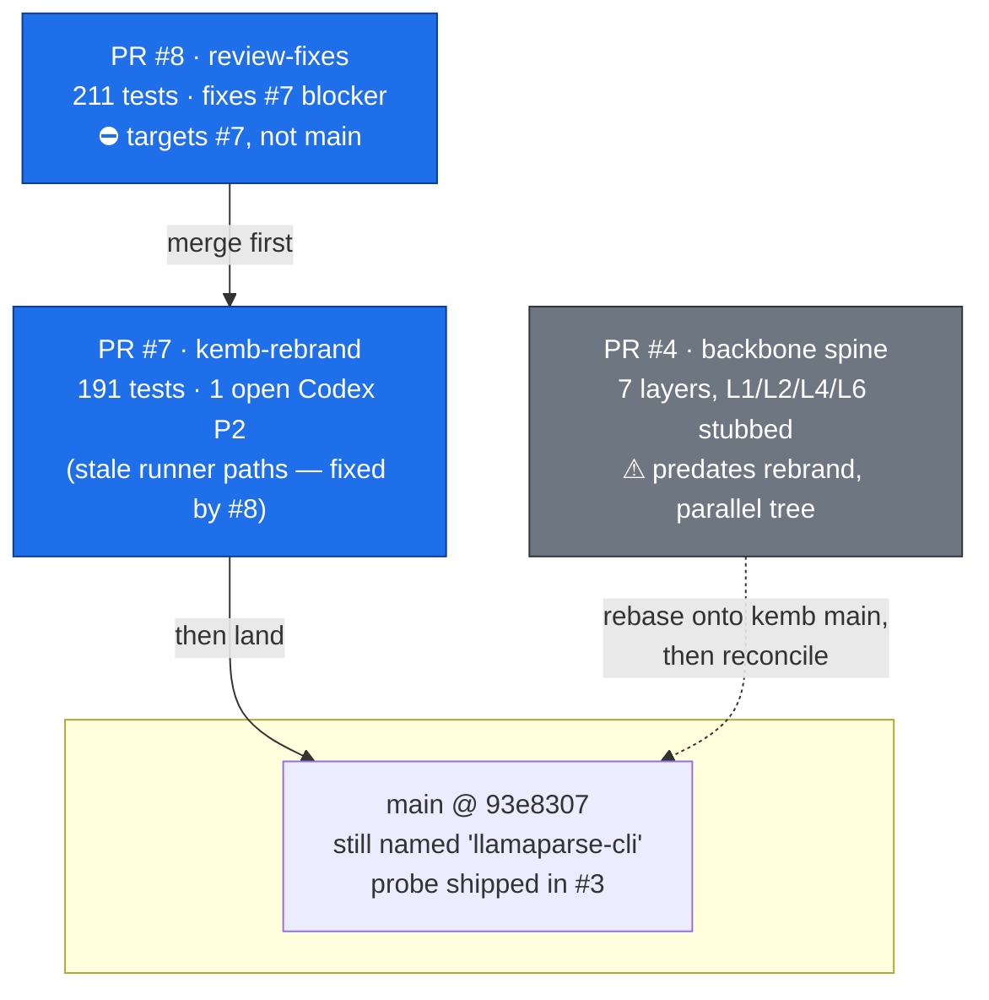
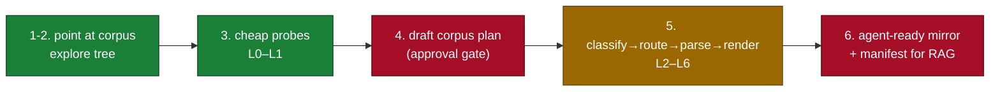
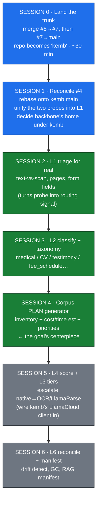

# kemb roadmap — where to spend the next few sessions

_Snapshot: 2026-06-03. Source of truth for sequencing the 3 open PRs against
[`docs/goal.txt`](./goal.txt): "point Claude at a directory, it explores and
creates a large-scale PDF triage + parse plan curated for agentic use."_

The goal already names the architecture: **a Claude skill _and_ backbone
integration**, with the user workflow mapped onto backbone layers **L0–L6**.
The three open PRs are not independent features — they are two halves of that
one goal, built in parallel and now out of sync:

| PR | What it is | Half of the goal |
|----|------------|------------------|
| **#7** `kemb-rebrand` → `main` | renames to `kemb`, folds 4 skills into 1 orchestrating skill, frames everything as **probe → plan → pass → mirror** | the **skill** front-end |
| **#8** `pr-review-fixes` → `#7` | fixes #7's review blocker, hardens error paths, +20 tests (211 total), bumps 0.5→0.6 | finishes the **skill** |
| **#4** `parsing-backbone-spine` → `main` | 7-layer `backbone/` engine (CIR + native_pdf + deterministic renderer); L1/L2/L4/L6 are stubs | the **backbone** engine |

## 1. PR state & merge order

> **No CI is configured** in this repo — the "pending" status on all three PRs
> just means zero checks, not a failing gate. Tests are run locally (211 / 191 / 3).

**The one ordering trap:** #8's base is `claude/kemb-rebrand`, so it must merge
into #7's branch _before_ #7 lands — or #7 must be retargeted. Merging #7 into
`main` first strands #8's fixes (including the fix for #7's own Codex review).

## 2. Goal workflow → backbone layers → what actually exists

| Goal step | Backbone layer | Status today | Lives in |
|-----------|----------------|--------------|----------|
| 1–2 explore tree | L0 corpus index | ✅ done | #4 `corpus.py`+`db.py` |
| 3 cheap probe | L0–L1 triage | 🟡 **two probes, unmerged** | kemb `_probe.py` (#3) **and** backbone `triage.py` (stub) |
| 4 **corpus plan** | (skill layer) | 🔴 **does not exist anywhere** | — |
| 5 classify | L2 classify | 🔴 stub (`doc_type="unknown"`) | #4 `classify.py` |
| 5 route+parse | L3 extract | 🟡 one tier (`native_pdf`) | #4 `extractors/` |
| 5 score/escalate | L4 arbitrate | 🔴 stub | #4 `score.py` |
| 5 render | L5 render | ✅ done (deterministic) | #4 `render.py` |
| 5 mirror | L6 sync | 🟡 publish only; reconcile stubbed | #4 `sync.py` |
| 6 manifest/RAG | (above L6) | 🔴 does not exist | — |

The two biggest gaps are **not in any PR**: the **corpus plan** (goal step 4 —
the skill's actual centerpiece and approval gate) and the **manifest** (step 6).

## 3. The session plan

### Session 0 — Land the trunk _(do this first; unblocks everything)_
- Merge **#8 into #7's branch**, then **#7 into `main`**. The repo's identity,
  the orchestrating skill, and the 211-test baseline all depend on this.
- #8 already resolves #7's only open review (the stale `parse_document.py`
  runner paths in the facet docs), so there is nothing left to fix first.

### Session 1 — Reconcile the backbone (#4) with the rebrand
- #4 was opened **May 15**, before the rebrand, and adds a **parallel
  `backbone/` package** next to `llamaparse_cli`. Rebase it onto the post-#7
  `main` and resolve the framing collision.
- **Unify the two probes:** kemb shipped `_probe.py` (inventory + metadata, no
  network) in #3; backbone's `triage.py` is the L1 stub for the same job. Pick
  one path so the skill has a single "explore the tree" entry point.
- Decide backbone's home: does `doc_backbone` become the engine the `kemb`
  skill calls, or fold into `src/kemb/`? Lock the boundary before building on it.

### Sessions 2–4 — Build the missing middle (the actual goal)
- **L1 triage** (Session 2): cheapest, highest-leverage — text-vs-scan ratio,
  page count, form fields. Everything downstream routes on this signal.
- **L2 classify + taxonomy** (Session 3): the doc-types already sketched in
  `config/doc_types.yaml` (medical_record, expert_testimony, cv, fee_schedule,
  exhibit, designation). Start rules/heuristics, LLM fallback below threshold.
- **Corpus plan generator** (Session 4): inventory summary + proposed taxonomy
  + **cost/time estimate** (pages × tier) + curation priorities, presented for
  approval. This is goal step 4 and exists in **no PR** — it's the centerpiece.

### Sessions 5–6 — Quality + delivery
- **L4 score + L3 tiers** (Session 5): score each CIR; escalate `native_pdf` →
  OCR / LlamaParse premium when it's thin. kemb already owns a working
  LlamaCloud client — wire it in as the premium extractor tier.
- **L6 reconcile + manifest** (Session 6): full drift reconcile, orphan GC, and
  the queryable **manifest** (goal step 6) so the mirror is RAG-ready.

---

**TL;DR:** land the kemb stack (#8→#7→main) this session; spend the next on
making #4 stop being a parallel universe; then the real build is L1→L2→**plan**,
which is the half of the goal that no PR has touched yet.
